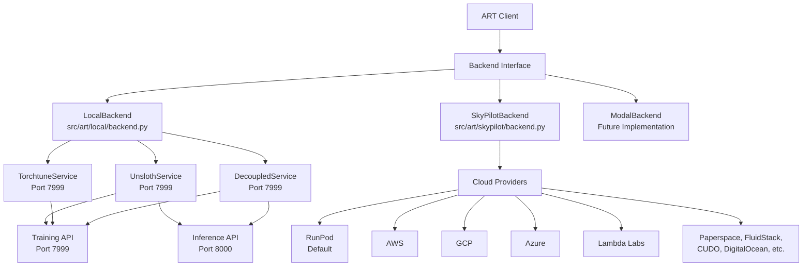
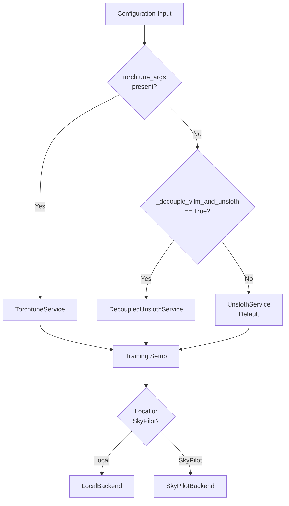

# ART Backend Architecture Specification

Based on comprehensive analysis of 10 parallel subagents, here's the complete specification for ART's backend abstraction system.

## Table of Contents

1. [Core Backend Interface](#core-backend-interface)
2. [Architecture Overview](#architecture-overview)
3. [Backend Implementations](#backend-implementations)
4. [Configuration System](#configuration-system)
5. [Resource Management](#resource-management)
6. [Job Execution Interface](#job-execution-interface)
7. [Security Model](#security-model)
8. [Error Handling & Resilience](#error-handling--resilience)
9. [Modal Backend Implementation Guide](#modal-backend-implementation-guide)

## Core Backend Interface

ART implements a client-server architecture where backends are HTTP-based services. The [`Backend` class](file:///home/jm/ART/src/art/backend.py) defines the core contract that all backend implementations must follow.

### Required Methods

**Model Management:**
- `register(model)` - Register a model for logging/training
- `close()` - Cleanup backend resources
- `_get_step(model)` - Get current training step
- `_delete_checkpoints(model, benchmark, benchmark_smoothing)` - Cleanup old checkpoints

**Training Infrastructure:**
- `_prepare_backend_for_training(model, config)` - Setup training environment, returns base_url and api_key
- `_train_model(model, trajectory_groups, config, dev_config, verbose)` - Train model on trajectory data, yields training metrics

**Logging & Metrics:**
- `_log(model, trajectory_groups, split)` - Log trajectory data for model evaluation

**Experimental Features:**
- S3 integration: `_experimental_pull_from_s3`, `_experimental_push_to_s3`
- Checkpoint forking: `_experimental_fork_checkpoint`
- Model deployment: `_experimental_deploy`

## Architecture Overview



### HTTP API Structure

All backend services expose standardized HTTP endpoints:

- **Port 7999**: Training and management API
  - `/train` - Training operations with streaming responses
  - `/healthcheck` - Service health monitoring
  - `/status` - Current training status
  - `/cleanup` - Resource cleanup operations

- **Port 8000**: Inference API (when applicable)
  - Model serving and inference endpoints
  - Compatible with OpenAI API format

## Backend Implementations

### 1. LocalBackend

**Location:** [`src/art/local/backend.py`](file:///home/jm/ART/src/art/local/backend.py)

**Use Case:** Local development and single-machine training

**Key Features:**
- Directory-based storage for models and checkpoints
- Weights & Biases (W&B) integration for experiment tracking
- Process isolation for resource management
- Support for GPU memory optimization

**Service Selection Logic:**
```python
if config.get("torchtune_args") is not None:
    service_class = TorchtuneService
elif config.get("_decouple_vllm_and_unsloth", False):
    service_class = DecoupledUnslothService
else:
    service_class = UnslothService
```

### 2. SkyPilotBackend

**Location:** [`src/art/skypilot/backend.py`](file:///home/jm/ART/src/art/skypilot/backend.py)

**Use Case:** Multi-cloud orchestration and distributed training

**Supported Cloud Providers:**
- **RunPod** (default) - GPU-focused cloud provider
- **AWS** - Amazon Web Services
- **GCP** - Google Cloud Platform
- **Azure** - Microsoft Azure
- **Lambda Labs** - ML-optimized infrastructure
- **Paperspace** - AI development platform
- **FluidStack** - Distributed GPU cloud
- **CUDO** - Sustainable compute platform
- **DigitalOcean** - Developer cloud
- **OCI** - Oracle Cloud Infrastructure
- **IBM Cloud** - Enterprise cloud platform

**Key Features:**
- Automatic cluster provisioning and teardown
- Multi-GPU distributed training support
- Cost optimization across providers
- Fault tolerance and job recovery

## Configuration System

### Backend Selection Logic



### Configuration Parameters

**Core Configuration:**
- `model_name` - Base model identifier
- `training_args` - Training hyperparameters
- `torchtune_args` - Torchtune-specific configuration
- `_decouple_vllm_and_unsloth` - Service decoupling flag

**Backend-Specific:**
- `backend_type` - "local" or "skypilot"
- `provider` - Cloud provider selection (SkyPilot)
- `gpu_type` - GPU specification (H100, A100, etc.)
- `num_gpus` - Multi-GPU configuration

## Resource Management

### Memory Management

**GPU Memory Optimization:**
- Context managers pause vLLM during training to free GPU memory
- Automatic memory cleanup between training sessions
- Dynamic memory allocation based on model size

**KV Cache Offloading:**
```python
# Memory hierarchy implementation
Level_1_CPU_Offloading = True    # Offload to CPU memory
Level_2_Discard = True           # Discard least recently used
disk_offload_dir = "/tmp/cache"  # Disk fallback storage
```

**Sleep/Wake Modes:**
- Services can be paused to free resources
- Automatic wake-up when inference is needed
- Configurable sleep timeouts

### Process Management

**Resource Isolation:**
- Separate processes for different model services
- Process termination kills "model-service" processes to free GPU memory
- Automatic cleanup on backend close operations

**Distributed Training:**
- Tensor parallel dimensions for multi-GPU setups
- Context parallel dimensions for large context models
- Dynamic resource allocation based on workload

## Job Execution Interface

### Streaming Operations

All training operations use the AsyncIterator pattern for real-time progress tracking:

```python
async def _train_model(
    self,
    model: str,
    trajectory_groups: list,
    config: dict,
    dev_config: dict,
    verbose: bool = False
) -> AsyncIterator[dict[str, float]]:
    """Train model with streaming progress updates."""
    # Implementation yields training metrics in real-time
    yield {"loss": 0.5, "step": 100, "lr": 1e-4}
```

**HTTP Streaming:**
- FastAPI StreamingResponse with JSON lines format
- Real-time progress updates via Server-Sent Events
- Client-side streaming consumption with async iterators

**Progress Tracking:**
- tqdm integration for visual progress bars
- Configurable update intervals
- Error state propagation through stream

### Resource Allocation

**Local Backend:**
```python
# Process management
process = subprocess.Popen([
    "python", "-m", "art.local.model_service",
    "--port", str(port),
    "--model-name", model_name
])

# GPU memory allocation
torch.cuda.empty_cache()  # Clear cache before training
```

**SkyPilot Backend:**
```python
# Cluster management
cluster_config = {
    "provider": "runpod",  # or aws, gcp, azure, etc.
    "gpu_type": "H100:1",  # GPU specification
    "disk_size": "500GB",  # Storage requirements
}
```

## Security Model

### Authentication

**Environment Variable Management:**
- `OPENAI_API_KEY` - OpenAI API access
- `ANTHROPIC_API_KEY` - Anthropic API access
- `WANDB_API_KEY` - Weights & Biases integration
- `AWS_ACCESS_KEY_ID`, `AWS_SECRET_ACCESS_KEY` - AWS credentials
- Provider-specific keys for cloud backends

**AWS Integration:**
- Leverages AWS CLI credential chains
- IAM role support for EC2 instances
- Cross-account access with assume role

**API Key Validation:**
```python
# Server configuration includes API key validation
server_config = {
    "api_key": generate_secure_api_key(),
    "ssl_cert": "/path/to/cert.pem",
    "ssl_key": "/path/to/key.pem"
}
```

### Communication Security

**HTTPS/TLS:**
- SSL certificate configuration with automatic rotation
- TLS 1.2+ enforcement for all HTTP communications
- Certificate validation for client connections

**CORS Configuration:**
- Web security compliance for browser-based clients
- Origin validation for cross-domain requests
- Preflight request handling

**Credential Isolation:**
- Provider-specific credential management
- No credential logging or exposure in error messages
- Secure credential storage and transmission

## Error Handling & Resilience

### Retry Mechanisms

**Exponential Backoff Configuration:**
```python
retry_config = {
    "max_attempts": 3,
    "initial_delay": 0.25,  # seconds
    "backoff_factor": 2.0,
    "max_delay": 60.0
}
```

**Multiple Sampling Strategies:**
- `retry` - Simple retry with exponential backoff
- `redundant` - Parallel requests with first-wins
- `majority` - Multiple requests with majority vote
- `ensemble` - Combine multiple model responses
- `unanimous` - Require all requests to agree

**Rate Limiting:**
```python
# AsyncLimiter configuration
rate_limiter = AsyncLimiter(
    max_rate=5,  # requests per second
    time_period=1.0
)
```

### Failure Recovery

**Exception Tolerance:**
```python
# Configurable failure thresholds
max_exceptions = config.get("max_exceptions", 10)
exception_count = 0

try:
    # Training operation
    pass
except Exception as e:
    exception_count += 1
    if exception_count > max_exceptions:
        raise RuntimeError("Too many exceptions during training")
```

**Health Checks:**
- `/healthcheck` endpoints for service monitoring
- Task polling with configurable timeouts
- Automatic service restart on health check failures

**Graceful Degradation:**
- Fallback values for failed operations
- Partial success handling in batch operations
- Circuit breaker patterns for external dependencies

## Modal Backend Implementation Guide

For implementing a Modal backend to extend ART's multi-cloud capabilities, follow this structured approach that leverages Modal's serverless architecture while composing with existing ART components.

### 1. Backend Class Implementation

Create a new backend class inheriting from the base Backend interface:

```python
# src/art/modal/backend.py
import modal
from art.backend import Backend

class ModalBackend(Backend):
    """Modal.com backend implementation for ART."""

    def __init__(self, gpu_type="H100", gpu_count=1, memory=32000, timeout=3600):
        super().__init__()
        self.gpu_type = gpu_type
        self.gpu_count = gpu_count
        self.memory = memory
        self.timeout = timeout
        self.app = None

    async def _prepare_backend_for_training(self, model, config):
        """Deploy Modal app and return connection details."""
        self.app = await self._deploy_modal_app(model, config)
        return {
            "base_url": self.app.web_url,
            "api_key": self.app.api_key
        }

    async def _train_model(self, model, trajectory_groups, config, dev_config, verbose):
        """Stream training metrics from Modal function."""
        # Compose with existing ModelService implementations through remote calls
        async for metric in self._stream_from_modal_function(model, trajectory_groups, config):
            yield metric
```

### 2. Modal Web Endpoint Implementation

Use `modal.asgi_app` for FastAPI integration with streaming support:

```python
# src/art/modal/app.py
import modal
from fastapi import FastAPI
from fastapi.responses import StreamingResponse
from art.local.unsloth_service import UnslothService
from art.local.torchtune_service import TorchtuneService
from art.local.decoupled_service import DecoupledUnslothService

# Modal app configuration
app = modal.App("art-training")

# GPU and image configuration
gpu_config = modal.gpu.H100(count=1)
image = modal.Image.debian_slim().pip_install([
    "torch", "transformers", "unsloth", "torchtune", "fastapi", "uvicorn"
])

# FastAPI app for ART endpoints
fastapi_app = FastAPI()

@fastapi_app.post("/train")
async def train_model_endpoint(request_data: dict):
    """Training endpoint with Server-Sent Events streaming."""
    def generate_training_metrics():
        # Select appropriate service based on config
        if request_data.get("torchtune_args"):
            service_class = TorchtuneService
        elif request_data.get("_decouple_vllm_and_unsloth", False):
            service_class = DecoupledUnslothService
        else:
            service_class = UnslothService

        # Use existing service implementations
        service = service_class(
            model_name=request_data["model"],
            config=request_data["config"]
        )

        # Stream training metrics
        for metric in service.train():
            yield f"data: {json.dumps(metric)}\n\n"

    return StreamingResponse(generate_training_metrics(), media_type="text/plain")

@fastapi_app.get("/healthcheck")
async def healthcheck():
    """Service health monitoring."""
    return {"status": "healthy"}

# Deploy FastAPI app to Modal
@app.function(
    image=image,
    gpu=gpu_config,
    memory=32000,
    timeout=3600,
    keep_warm=1
)
@modal.asgi_app()
def art_web_app():
    return fastapi_app

# Programmatic URL access
@app.function()
def get_app_url():
    """Get the deployed app URL programmatically."""
    return art_web_app.web_url
```

### 3. Configuration System

Follow ART's explicit parameter pattern:

```python
# Configuration follows LocalBackend and SkyPilotBackend patterns
modal_config = {
    "gpu_type": "H100",      # A100, H100, T4, etc.
    "gpu_count": 1,
    "memory": 32000,         # MB
    "timeout": 3600,         # seconds
    "keep_warm": 1           # Number of containers to keep warm
}

# Usage example
backend = ModalBackend(
    gpu_type="H100",
    gpu_count=1,
    memory=32000,
    timeout=3600
)
```

### 4. Authentication

Modal authentication is handled automatically via `~/.modal.toml` (created by `modal setup`):

```python
# No custom authentication code needed
# Modal automatically uses ~/.modal.toml for:
# - API tokens
# - Environment configuration
# - Profile settings
```

### 5. Error Handling and Retry Configuration

Implement Modal-specific error patterns and automatic retry configuration:

```python
# src/art/modal/error_handling.py
import modal
from tenacity import retry, stop_after_attempt, wait_exponential

class ModalErrorHandler:
    """Handle Modal-specific errors with platform-aware retry logic."""

    @retry(
        stop=stop_after_attempt(3),
        wait=wait_exponential(multiplier=1, min=4, max=10)
    )
    async def handle_function_execution(self, func, *args, **kwargs):
        """Execute Modal function with automatic retry."""
        try:
            return await func.remote(*args, **kwargs)
        except modal.exception.TimeoutError as e:
            # Modal handles timeout gracefully, just retry
            raise e
        except modal.exception.FunctionNotFoundError as e:
            # Function deployment issue, should not retry
            raise RuntimeError(f"Modal function not deployed: {e}")
        except Exception as e:
            # Let Modal's built-in retry handle other transient issues
            raise e

    async def handle_app_deployment(self, app):
        """Handle app deployment with Modal's built-in resilience."""
        try:
            await app.deploy()
            return app.web_url
        except modal.exception.InvalidError as e:
            raise ValueError(f"Invalid Modal app configuration: {e}")
```

### 6. Integration Testing

Focus on functionality testing rather than resource management:

```python
# tests/test_modal_backend.py
import pytest
from art.modal.backend import ModalBackend

@pytest.mark.asyncio
async def test_modal_training_workflow():
    """Test end-to-end training workflow on Modal."""
    backend = ModalBackend(gpu_type="T4", memory=16000)

    model = "test-model"
    config = {"max_steps": 10}
    trajectory_groups = []

    # Test training stream
    metrics = []
    async for metric in backend._train_model(model, trajectory_groups, config, {}, True):
        metrics.append(metric)
        if len(metrics) >= 5:  # Test first few metrics
            break

    assert len(metrics) > 0
    assert "loss" in metrics[-1]
    assert "step" in metrics[-1]

@pytest.mark.integration
async def test_modal_web_endpoint():
    """Test Modal web endpoint deployment and access."""
    backend = ModalBackend()

    # Test app deployment
    app_info = await backend._prepare_backend_for_training("test-model", {})
    assert "base_url" in app_info
    assert "api_key" in app_info

    # Test endpoint accessibility
    url = app_info["base_url"]
    assert url.startswith("https://")

@pytest.mark.unit
def test_modal_backend_configuration():
    """Test configuration parameter handling."""
    backend = ModalBackend(
        gpu_type="A100",
        gpu_count=2,
        memory=64000,
        timeout=7200
    )

    assert backend.gpu_type == "A100"
    assert backend.gpu_count == 2
    assert backend.memory == 64000
    assert backend.timeout == 7200
```

### Key Integration Points

**Direct Usage Pattern:**
Modal backend should be used interchangeably with other backends:

```python
# Usage examples - no factory function needed
LOCAL = False
if LOCAL:
    local_backend = LocalBackend()
else:
    modal_backend = ModalBackend(gpu_type="H100", memory=32000, num_gpus=2)

model = art.TrainableModel(...)

# All backends follow the same interface
await model.register(modal_backend)

if not LOCAL:
    await modal_backend.down()
```

**Resource Management:**
Modal handles resource allocation automatically - no custom resource management needed. The platform automatically:
- Allocates and deallocates GPU resources
- Manages container lifecycle
- Handles scaling and load balancing
- Provides built-in retry and error recovery

**Service Composition:**
Rather than creating new service implementations, compose with existing ones:

```python
# Modal functions call existing services remotely
def select_service_class(config):
    if config.get("torchtune_args"):
        return TorchtuneService
    elif config.get("_decouple_vllm_and_unsloth", False):
        return DecoupledUnslothService
    else:
        return UnslothService
```

The Modal backend implementation leverages Modal's serverless architecture while maintaining full compatibility with ART's existing patterns and service implementations.

---

## File References

**Core Backend Files:**
- [`src/art/backend.py`](file:///home/jm/ART/src/art/backend.py) - Base backend interface
- [`src/art/local/backend.py`](file:///home/jm/ART/src/art/local/backend.py) - Local backend implementation
- [`src/art/skypilot/backend.py`](file:///home/jm/ART/src/art/skypilot/backend.py) - SkyPilot backend implementation

**Service Implementations:**
- [`src/art/local/model_service.py`](file:///home/jm/ART/src/art/local/model_service.py) - Base model service
- Service-specific implementations in respective directories

**Configuration Files:**
- [`pyproject.toml`](file:///home/jm/ART/pyproject.toml) - Project configuration
- [`skypilot-config.yaml`](file:///home/jm/ART/skypilot-config.yaml) - SkyPilot configuration

**Documentation:**
- [`README.md`](file:///home/jm/ART/README.md) - Project overview
- [`docs/`](file:///home/jm/ART/docs/) - Additional documentation

This specification provides a comprehensive foundation for understanding, extending, and implementing new backends for the ART system while maintaining consistency with the existing architecture.
